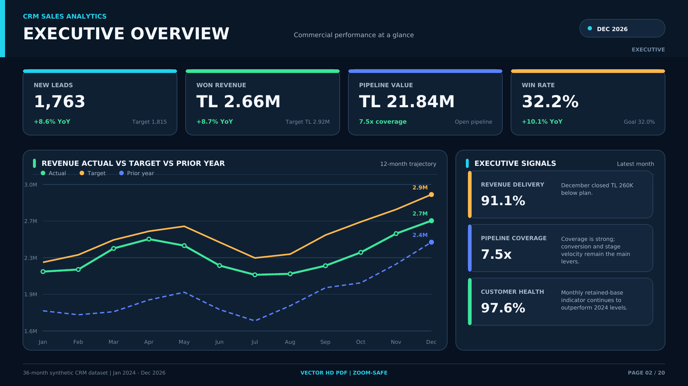

# CRM Sales Analytics & Business Intelligence Dashboard



## Project Overview

CRM Sales Analytics & Business Intelligence Dashboard is an end-to-end
business intelligence portfolio project developed using Power BI, DAX,
Power Query, Tableau and Microsoft Excel.

The project transforms 36 months of synthetic CRM data into actionable
sales insights and executive-level reporting. It covers lead generation,
sales funnel conversion, revenue performance, pipeline health, customer
acquisition, churn, lead source efficiency and sales representative
performance.

The repository contains the complete Power BI PBIP project, Tableau
workbook, Excel dashboard, structured datasets, DAX measures, dashboard
theme, Turkish and English executive presentations and a professional
20-page vector HD PDF report.

## Executive Summary

| Metric | Latest Result |
|---|---:|
| Reporting Period | January 2024 - December 2026 |
| December 2026 New Leads | 1,763 |
| December 2026 Won Revenue | TL 2.66M |
| December 2026 Pipeline Value | TL 21.84M |
| December 2026 Win Rate | 32.2% |
| 2026 Annual Revenue | TL 27.80M |
| 2026 Revenue Target | TL 30.09M |
| 2026 Revenue Target Attainment | 92.4% |
| Revenue Growth: 2024-2026 | 32.1% |
| Lead Growth: 2024-2026 | 24.1% |

## Business Problem

Sales organizations frequently manage performance data across multiple
systems, spreadsheets and disconnected reports. This makes it difficult
for decision-makers to answer critical business questions such as:

- Is the sales organization achieving monthly lead and revenue targets?
- How effectively are leads converted into qualified prospects?
- Where are the largest conversion losses in the sales funnel?
- Which lead sources generate the highest-quality prospects?
- Which acquisition channels provide the strongest cost efficiency?
- Which sales representatives contribute the most revenue?
- Is the current pipeline sufficient to support future revenue targets?
- How does current performance compare with the previous year?
- Which commercial areas require immediate management attention?

This project consolidates these analytical requirements into a unified,
multi-platform business intelligence framework.

## Project Objectives

- Monitor monthly CRM and sales performance
- Compare actual results against business targets
- Measure year-over-year growth
- Analyze previous-year performance
- Evaluate the complete lead-to-win sales funnel
- Identify funnel conversion bottlenecks
- Monitor revenue performance and target attainment
- Evaluate pipeline value and coverage
- Compare sales representative productivity
- Identify high-volume and cost-efficient lead sources
- Track customer acquisition, churn and retention
- Support executive decision-making
- Produce presentation-ready management reports
- Demonstrate a reusable multi-platform BI architecture

## Tools and Technologies

| Category | Technologies |
|---|---|
| Business Intelligence | Power BI, Tableau |
| Data Preparation | Power Query, Microsoft Excel |
| Calculations | DAX, Excel Formulas |
| Data Modeling | Relational Modeling, Calendar Dimension |
| Dashboard Development | Power BI Desktop, Tableau, Excel |
| Project Format | PBIP, TWB, XLSX |
| Executive Reporting | PowerPoint, Vector HD PDF |
| Version Control | GitHub, GitHub Desktop |
| Visualization | KPI Cards, Funnel Charts, Trends, Variance Analysis |

## Data Preparation

The project uses structured synthetic CRM data covering 36 months of
commercial activity from January 2024 to December 2026.

The underlying data includes:

- Monthly lead generation
- Monthly lead targets
- Qualified leads
- Sales opportunities
- Won deals
- Average deal size
- Won revenue
- Revenue targets
- Pipeline value
- Sales cycle duration
- New customers
- Customer churn
- Lead source performance
- Acquisition spending
- Sales representative performance

The data was standardized and organized into dedicated monthly,
representative and lead source tables.

## Dataset Structure

| Dataset | Description |
|---|---|
| `crm_monthly.csv` | Monthly CRM, funnel, revenue, target, pipeline and customer KPIs |
| `crm_rep_performance.csv` | Monthly sales representative performance |
| `crm_lead_sources.csv` | Monthly lead source volume, quality and acquisition spend |

The Calendar table is maintained within the Power BI semantic model and
does not require a separate CSV file.

## Power BI Data Model

The Power BI semantic model uses a central Calendar table connected to
the CRM performance tables through one-to-many relationships.

```text
Calendar[Date] 1 ---- * crm_monthly[Month]

Calendar[Date] 1 ---- * crm_rep_performance[Month]

Calendar[Date] 1 ---- * crm_lead_sources[Month]
```

Single-direction filtering is used to ensure consistent month-based
filtering and reliable KPI calculations throughout the report.

## Key KPIs

### Lead Generation KPIs

- New Leads
- Lead Target
- Qualified Leads
- Lead Qualification Rate
- Lead Target Attainment
- Previous-Year Leads
- Year-over-Year Lead Growth
- Actual vs Target Lead Variance

### Sales Funnel KPIs

- New Leads
- Qualified Leads
- Opportunities
- Won Deals
- Lead-to-Qualified Conversion
- Qualified-to-Opportunity Conversion
- Opportunity-to-Won Conversion
- Lead-to-Win Conversion
- Win Rate

### Revenue KPIs

- Won Revenue
- Revenue Target
- Revenue Target Attainment
- Revenue Variance
- Previous-Year Revenue
- Year-over-Year Revenue Growth
- Average Deal Size

### Pipeline KPIs

- Pipeline Value
- Pipeline Coverage
- Active Opportunities
- Opportunity Momentum
- Won Deals
- Sales Cycle Duration

### Sales Representative KPIs

- Representative Revenue
- Representative Target
- Representative Target Attainment
- Representative Win Rate
- Representative Opportunities
- Representative Won Deals
- Average Sales Cycle

### Customer KPIs

- New Customers
- Customer Acquisition
- Churn Rate
- Retention Indicator
- Average Deal Size
- Customer Growth

## DAX Development

Reusable DAX measures were developed for:

- New Leads
- Qualified Leads
- Lead Target
- Won Revenue
- Revenue Target
- Pipeline Value
- Win Rate
- Target Attainment
- Sales Cycle
- Previous-Year Performance
- Year-over-Year Growth
- Actual vs Target Variance
- Pipeline Coverage
- Qualification Rate
- Opportunity Conversion Rate

These measures support consistent calculations across KPI cards, charts,
tables, funnel visuals and time-based comparisons.

## Dashboard Features

- Selectable monthly reporting structure
- Single-month dashboard filtering
- Three-year historical analysis
- Actual vs target comparisons
- Previous-year comparisons
- Year-over-year growth calculations
- Interactive KPI cards
- Sales funnel visualization
- Pipeline coverage monitoring
- Revenue trend analysis
- Lead source analysis
- Representative-level performance reporting
- Customer acquisition analysis
- Churn and retention reporting
- Modern dark-themed executive design
- Vector-based executive PDF output

## Dashboard and Report Pages

The executive report contains 20 professional pages:

1. CRM Sales Analytics Cover
2. Executive Overview
3. Management Scorecard
4. Lead Generation
5. Lead Target Attainment
6. Sales Funnel
7. Funnel Conversion Trends
8. Lead Source Volume
9. Lead Source Efficiency
10. Revenue Performance
11. Revenue Variance
12. Pipeline Health
13. Opportunity Momentum
14. Sales Team Overview
15. Sales Representative Leaderboard
16. Sales Representative Productivity
17. Customer Growth
18. Churn and Retention
19. Three-Year Performance
20. Executive Priorities

## Key Business Insights

### Revenue Growth

Annual won revenue increased from approximately TL 21.04 million in
2024 to TL 27.80 million in 2026.

This represents approximately 32.1% revenue growth over the three-year
analysis period.

### Lead Generation Growth

Annual lead volume increased from 14,675 leads in 2024 to 18,206 leads
in 2026.

This represents approximately 24.1% growth between 2024 and 2026.

### Revenue Target Performance

The organization generated approximately TL 27.80 million in annual
revenue against a 2026 target of TL 30.09 million.

Annual revenue target attainment reached approximately 92.4%, leaving
a remaining gap of approximately TL 2.29 million.

### December Performance

December 2026 produced:

- 1,763 new leads
- 900 qualified leads
- 400 opportunities
- 129 won deals
- TL 2.66 million in won revenue
- TL 21.84 million in pipeline value
- 32.2% win rate
- 91.1% monthly revenue target attainment

### Pipeline Health

December pipeline coverage reached approximately 7.5 times the monthly
revenue target.

The strong coverage level indicates sufficient pipeline value; however,
the gap between pipeline and realized revenue suggests that conversion
discipline and opportunity velocity should remain management priorities.

### Lead Source Performance

Organic Search generated the highest overall lead volume.

Referral demonstrated one of the strongest qualification rates at
approximately 67% and the lowest cost per qualified lead.

The cost difference between Referral and several paid channels
indicates an opportunity to optimize acquisition spending.

### Sales Team Performance

Deniz Koç and Can Arslan exceeded their annual individual revenue
targets.

- Deniz Koç achieved approximately 130.5% target attainment.
- Can Arslan achieved approximately 113.0% target attainment.

The performance patterns of the strongest representatives can be used
to improve prospecting, qualification and closing practices across the
sales team.

### Customer Health

Average customer churn improved compared with 2024 levels.

The improvement indicates stronger customer retention performance;
however, continued customer health monitoring is required as acquisition
volume increases.

## Repository Structure

```text
crm-sales-analytics-bi-dashboard/
├── README.md
├── LICENSE
├── .gitignore
│
├── Power-BI/
│   ├── CRM_Sales_Analytics_PBIP/
│   │   ├── CRM_Sales_Analytics.pbip
│   │   ├── CRM_Sales_Analytics.Report/
│   │   └── CRM_Sales_Analytics.SemanticModel/
│   ├── CRM_Measures.dax
│   └── crm_dark_theme.json
│
├── Tableau/
│   ├── CRM_Sales_Dashboard.twb
│   ├── crm_monthly.csv
│   ├── crm_rep_performance.csv
│   └── crm_lead_sources.csv
│
├── Excel/
│   └── CRM_Sales_KPI_Dashboard.xlsx
│
├── Data/
│   ├── crm_monthly.csv
│   ├── crm_rep_performance.csv
│   └── crm_lead_sources.csv
│
├── Presentation/
│   ├── CRM_Satis_Analitigi_Profesyonel_Sunum_TR.pptx
│   └── CRM_Sales_Analytics_Professional_Deck_EN.pptx
│
├── Reports/
│   └── CRM_Sales_Analytics_20_Page_HD_Professional.pdf
│
└── Images/
    └── executive-overview.png
```

## How to Open the Files

### Power BI

1. Download or clone the complete repository.
2. Open the following folder:

```text
Power-BI/CRM_Sales_Analytics_PBIP/
```

3. Double-click:

```text
CRM_Sales_Analytics.pbip
```

4. Open the project using a current version of Power BI Desktop.
5. Keep the `.pbip`, Report and SemanticModel folders together.

The PBIP file depends on its accompanying project folders. Moving only
the `.pbip` file may prevent the report from opening correctly.

### Tableau

1. Open the `Tableau` folder.
2. Keep the Tableau workbook and CSV files in the same folder.
3. Open `CRM_Sales_Dashboard.twb` using Tableau Desktop or Tableau
   Public.
4. If Tableau requests a data connection, select the corresponding CSV
   file from the same folder.

### Microsoft Excel

1. Open the `Excel` folder.
2. Open `CRM_Sales_KPI_Dashboard.xlsx`.
3. If Excel opens the workbook in Protected View, select
   `Enable Editing`.
4. Use the dashboard worksheets and filters to review the analysis.

### Executive Presentations

The `Presentation` folder contains two executive presentations:

- Turkish professional executive presentation
- English professional executive presentation

### Executive PDF

The `Reports` folder contains a professional 20-page executive report.

The PDF uses a 16:9 layout and vector-based charts and text. Its pages
were validated at 1920 x 1080 resolution and remain sharp when zoomed.

## Live Dashboard Status

- Power BI Service: Not publicly deployed
- Tableau Public: Not publicly deployed

Public interactive dashboard links will be added after publication.

## Data Disclaimer

All information used in this project is synthetic sample data created
for educational, analytical and portfolio demonstration purposes.

The repository does not contain real customer, employee, financial or
confidential company information.

## License

This project is available under the terms of the MIT License.

See the [LICENSE](LICENSE) file for additional information.

## Author

**Murat Miraç Gedik**

Business Intelligence | Data Analytics | Power BI | Tableau |
Microsoft Excel
